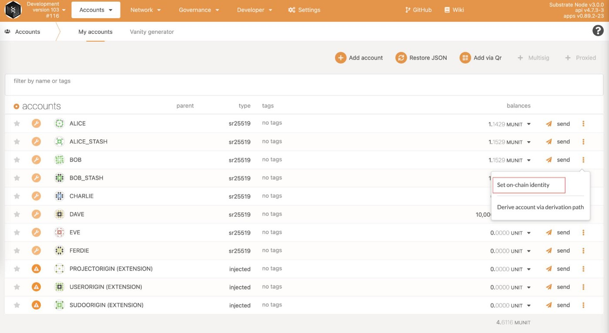
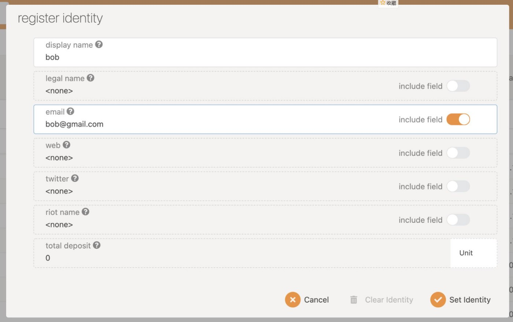
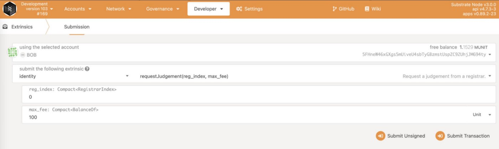

## Set on-chain Identity

**For better collaboration, we strongly suggest each developer to set up an identity on OAK Network. Here is how.**

### Set Identity

On polkadot.js apps page, select the “Accounts” tab and select “Set on-chain identity” with your account as shown below.

Enter your identity information and click the “Set Identity” button.

After the transaction is confirmed, there will be a gray minus sign to the left of the account name, indicating that the account has been authenticated but has not yet passed the review.

### Request Judegement

Use your account to send a “requestJudgement” transaction.
Select “Developer” -> “Extrinsics”, then call the “requestJudgement” method in the “identity” module, specify the Bob account, enter the corresponding information (here RegistrarIndex is entered as 0(index of Alice), and max_fee is entered as 100), then sign and submit the transaction.

### Waiting for the request to be approved

You can ask registar to review your request in [OAK Discord room](https://discord.gg/RgX8bsXR).

After the transaction is confirmed, you can see a green symbol on the left side of the your address, indicating that the identity verification is approved.

