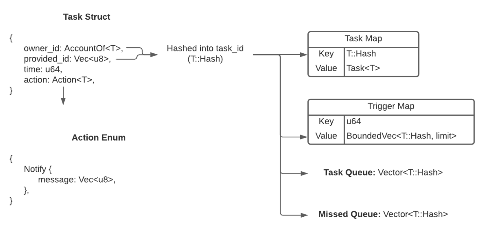
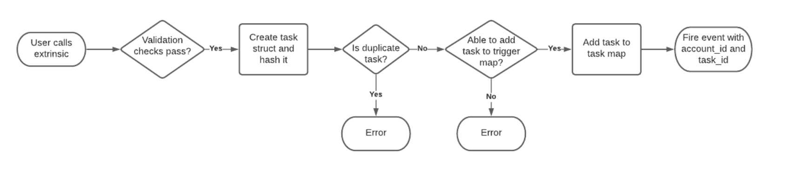
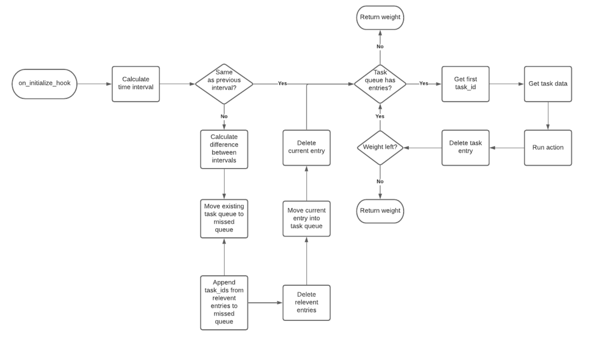

## Context
The first milestone for our parachain is to support a user being able to send events on a time delay. These events will support custom text and will be fired on-chain. Our time triggers will exist on predefined intervals. These will be evaluated during the on-initialize block and will be limited to a max weight per block. This design document will cover the following features.

- Scheduling a task to fire an event with custom text
- Canceling a task
- Firing an event with custom text based on a time trigger
- Handling “skipped” tasks

## Definitions
- trigger: conditional logic that has to be true for a task to be executed
- action: the function to execute for a given trigger
- task: a trigger and an action. A user will add a task to execute 10 recurring payments at the 30th of each month.
- transaction: the conventional definition of a transaction in Polkadot (message, payment, anything that is stored in the “ledger”). For example, while the scheduling of a task is a transaction the execution of the action is not.
- Timestamp: Unix standard time
- Task map: A hashmap that exists in storage. Used to store task information.
- Trigger map: A hashmap that exists in storage. Used to store trigger information.
- Task queue: A vector that exists in storage. Used to store task_ids that for the tasks that are ready to be executed.
- Missed queue: A vector that exists in storage. Used to store task_ids for the tasks that weren’t executed during their scheduled slot.

## Technical Implementation
### Task Storage
We will use four data structures to store task data. The first will store information on the action. 
This will contain the owner, and any information needed in order to perform the action. Eventually this will also contain information needed for recurring tasks, such as a schedule and number of times to run. This information will be stored in a hashmap, we will call this the task map. The task map will store a struct with the information mentioned above as the value, and the key(task_id) will be a hash of the provided_id and the account_id. The second will store information on the trigger. We will store this information in a hashmap, we will call this the trigger map. The trigger map will store a time interval, in unix time, and a bounded vector of task_ids. The bound for the vector will be determined by how many tasks we can ensure will run within a time interval. The third will store the task_ids for the tasks that are ready to be executed. This will be a vector of task_ids. The fourth will store the task_ids for the tasks that missed their scheduled stot. This will be a vector of task_ids.

It is worth taking some time to explain why we require the caller to provide an id. In order to interact with these tasks we need to assign a unique id to them. In a Web 2.0 world this is easy. The backend would generate a uuid, assign it to the task, and return it to the caller. In Web 3.0 this is a bit more complicated because we cannot return a response to the caller immediately due to the delay of block confirmation, and we cannot generate random ids. The first idea that comes to mind is to hash the entire task object. While this does provide a unique id per task, it stops you from having duplicate tasks. Where a duplicate is any task with the exact same trigger and action. We understand that there are legitimate reasons for a user to need duplicate tasks so we discarded this idea. The next logical idea is for the caller to provide a unique id. While this does put the burden on the caller to provide this id, for most use cases the caller will be code and not a person. Since we are hashing the caller’s account_id and the provided_id for the task_id, the provided_id only needs to be unique to that caller.

** The task struct may need to store extra information depending on the fee structure. I am specifically thinking about if a task is canceled and we want to issue a partial refund. 

** It is worth noting that the maximum recommended size for a value in RockDB is 3GB. This means we could store over 300,000,000 taskIds for each time interval. As we will not be able to support anywhere near that many tasks per time interval, memory is not a constraint.

** Since we are using a hash of the account_id and the provided_id it is up to the user to supply unique ids. Granted these only need to be unique for that user.

### Task Creation
A user will call an extrinsic in order to create a task. This extrinsic will be called “Time Triggers” with a function called “Notify”, and will accept a Vec<u8> as input. This will require a unix timestamp for the trigger, and a string for the message in the event. The extrinsic will have the following validity checks.

- The transaction is signed
- The message has a length greater than 0
- The provided_id has a length greater than 0
- The timestamp is at least one interval in the future
- The timestamp is one of our predefined time slots

It is worth spending some time on the last check. We are not supporting scheduling a task for any time. Instead, we are supporting a predefined list of times. These can be derived from the interval we are supporting. For example, if our interval is one minute then the user can only schedule tasks for timestamps that end in whole minutes. 

`<timestamp> % 60 = 0`

Once these checks have passed we will create an instance of the task struct. The account_id and provided_id will be hashed, using a Blake hash, and be used as the task_id. Next we will attempt to add the task_id to the trigger map. As a reminder we can only support a limited amount of tasks per time interval (we are using 100 as a placeholder). If the requested time interval is full we will fail the extrinsic and throw an error. Else, we will add the task_id to the time interval. Then we will store the task in the task map using the hash as the key, and the task as the value. Finally, we will send an event with the account_id of the caller and the task_id. This will allow the user to look up their task_id by querying the storage of the System pallet.

** We will only have entries in the trigger map for intervals that have tasks scheduled. This means task creation could also include adding a new time interval to the trigger map.

### Task Cancellation
A user will call an extrinsic in order to cancel a task. This will require the task to not have been completed yet, the task_id, and for you to be the owner of the task or be sudo. This will result in us deleting the entry from the task map, and removing the task_id from the trigger map.

** If removing the task_id from the trigger map results in no tasks being scheduled for the given time interval then we will also delete that interval from the map.

### Triggering Tasks
All time triggered tasks will run during the on_initialize hook. Each block will have a percentage of its weight set aside for these tasks. This allows us to guarantee that a task will run within a given time interval, but does enforce a limited amount of tasks per interval. For this phase of the MVP we will use 10% as a placeholder value.

At the start of the on_initialize_hook we will determine what time interval the block is part of. This involves getting the blocks timestamp from the timestamp pallet get function. This will ultimately give us the time from the last block (since the current block’s timestamp is not set until much later), so we will always be a few seconds behind. At this point we will convert the given time to its relevant time slot. To do this we will simply subtract the extra time. For now we are using a minute as our placeholder time interval, so we will subtract the extra seconds. This means the timestamp will ultimately be cleanly divisible by 60. 

Once we have identified the time slot we will check to see if we have already seen this time slot. If we have, we start executing tasks from the task queue. If we haven’t, then we need to move all relevant task_ids to the missed queue and refresh the task queue with the relevant time trigger entry. To do this we will start by moving all the entries in the task queue to the missed queue. Then we will get the difference between the current time slot and the last seen time slot. We will then loop through all the time slots in between these starting at the oldest and ending right before the current time slot. For each time slot we will append its task_ids to the missed queue and then remove the entry from the trigger map. We will then move the current time slot’s task_ids to the task queue. This method ensures we are only executing tasks in their scheduled time slot (or within a few seconds of it), else we will send an event saying we missed the scheduled task. From here we just keep grabbing the first task from the task queue and executing it until we run out of weight or the queue is empty. 

In order to handle the missed queue without affecting scheduled tasks we will wait until there is weight left. In order to ensure this will happen we will never schedule the maximum number of tasks we can support for a time slot, and we will keep certain slots open. The details of this will be defined in phase 4.

