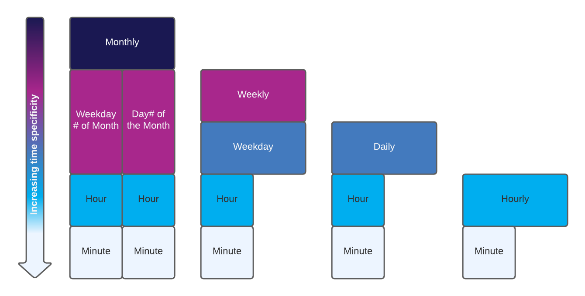

## Users
- Folks interacting with the extrinsics tab on PolkadotJS. The DApp experience is not encompassed in this PRD.
- Savvy investors and polkadotJS users who want to do dollar/token cost averaging (DCA)
- Builders who want to create payment streams or subscription. (JS-SDK, Rust SDK, etc.)

## Context
In our path to fleshing out first-class triggers and actions, we are building upon the MVP of a single future time trigger (N=1) to execute an event action (sending an event on-chain). We are only focused on adding to the trigger for this PRD. The action to be executed is out of scope for this PRD. You can assume any given action that is currently available (today, it’s sending an event on-chain). 

We believe that adding N>1 future transactions can enable a slew of use cases for Layer 2 applications:
- Payment streams
- Subscription services
- Payroll services
- Dollar cost averaging
…and many more

## Definitions
- N: frequency of a trigger (N=100 for a daily task means the user wants the task to happen every day for 100 days)
- M: frequency of a task (M=100 means that a user’s wallet has 100 tasks in the registry)
- trigger: conditional logic that has to be true for a task to be triggered
- action: the function to execute for a given trigger
- task: a user’s setting of a trigger and action. A user will add a task to execute 10 recurring payments at the 30th of each month.
- event: the conversion of a task into a transaction with a trigger in OAK’s registry. In other words, transaction + trigger saved in the registry.
- transaction: the conventional definition of a transaction in Polkadot (message, payment, anything that is stored in the “ledger”)
- signed vs unsigned transaction: a signed transaction required a user to sign one task with their private key (e.g. to pay someone monthly), while an unsigned transaction is low risk transaction like a log or a non-transfer event (this deviates a bit from Polkadot’s definition)
- signed future transaction: a transaction that requires a user to sign their private key to execute the transaction (e.g. asset transfer from wallet A to B)
- Timestamp: Unix standard time

## Requirements: Slippage of recurring execution
If for any reason, the time window has passed for the trigger, default to not execute the action and remove it from the event registry. 
- A user who wants a task to happen daily is expecting that task to happen anytime that day. Whereas a user who wants something to happen down to the minute is likely monitoring that task closely to ensure that it happens.
- If the minute window has passed and there was downtime in the system, remove that task and send an event to the chain indicating that it was removed (so as to notify the user down the road).
- This applies to daily tasks as well. If for example, a whole 2 days has passed and the window for the action was missed, send an event and remove it from the registry.

The rationale for this is that inherent in the user’s time specificity selection is their error tolerance.
- Additionally, this is the safest assumption of user intent. We don’t want to be culpable of any funds accidentally sent twice (once manually because the user processes the transaction separately when it didn’t execute, then again when OAK triggers it). A loss of funds (unintentionally) would cause more user heartburn than a non-action (especially if we pair the non-action with an off-chain notification to the user down the road).
- Blockchain transactions are permanent.
- We cannot assume user sentiment, and we do not at this time want to provide additional slippage inputs for the user (e.g. should we default to execute the action with an additional fee).

The user will see a cancellation event on the blockchain once the time window has passed.

## Requirements: Cancellation
- A user should be able to remove any recurring task. If they remove that task, no future task will execute. Past events will be unaffected.
- The user must only be able to remove their own task. A user cannot do it on behalf of another (with the exception of sudo).
- A refund will NOT be issued (upon initial launch) for any cancelled tasks. This will need to be scoped in when fees are higher (likely with XCMP).

## Requirements: Extrinsics fields
Maximum number of timestamps to set (for the extrinsics array) should be 24. The rationale being: we want to incentivize positive behavior, spamming every minute on the min (60) would yield lots of missed tasks. The behavior of hourly is our recommended lowest cadence.
- We may choose to bump this with more feedback.
- As a workaround, devs can always do 2 different extrinsic calls if they need 48 tasks scheduled (for example).

We want to enable different time specificities but offload as much of the compute of the recurring task upstream (via JS SDK or DApp). 

## Constraints
No task can be further than 6 months into the future. This is an arbitrary number that we can increase with time. 

The smallest time block is 1 minute, however, we will build a buffer so that our block still has %age saved for other computations. 
- A potential use case for a minute is for time-based auctions.
- It is possible for a malicious actor to fill blocks by not having a capped N or M. This would prevent others from inserting their tasks in the system. However, there are other drivers preventing this.
- We can miss out on a lot of minute-level tasks if we have a stall/lag in the chain.

Counter-factors:
- Higher fees if someone wants to fill the block.
- Alerting and monitoring off-chain would indicate that the N and/or M are high, and we can close the valve.

We are not allowing a top-level “Monthly” or “Weekly” without specifying a day due to a lack of use case to be that vague. It gives OAK too much optionality to execute in that time window and can lead to a bad user experience as to when the trigger will actually be pulled.

Duplicate timestamps in the array should be rejected by the extrinsic filter.

## UX Considerations
- A user must specify a day for a Monthly or Weekly trigger.
- A user must specify a start time (in Unix).

### Extrinsics UI
- Walkthrough: If the user has the timestamp list: 1644563539, 1646982739, 1649657539, 1652249539. And sets it as Monthly. We can assume that from the DApp, the user wanted a task executed on the 10th of the month, every month for 4 months.
- Input 1: This payment can occur anytime during that: Day, Hour, Minute
- Input 2: expanding list accepting Unix timestamps
- Input 3: Action information

### JS SDK
- This should be much more human readable. We should allow a setDailyTask() or setMonthlyTask() function to make it simpler for the developer. 
- The design of this will be discussed separately.

## Future Requirements (ie OUT OF SCOPE)
- Increasing max N for partners (N>100 for a given wallet; presumably a super user or partner or DAO). This does need to be editable in the future per wallet. The editing will be done via extrinsic.
- Edit the number of recurring events (e.g. change from 12 monthly payments to 8 monthly payments). If the user would like to do this, they must cancel and create a new task.
- Edit the time trigger of recurring events (e.g. change from every 1st of the month to every 3rd of the month). Similar to the above; edit is cancel old one then create a new one.
- Setting fees for recurring tasks and refunds.
- Increasing time specificty down to the minute.
