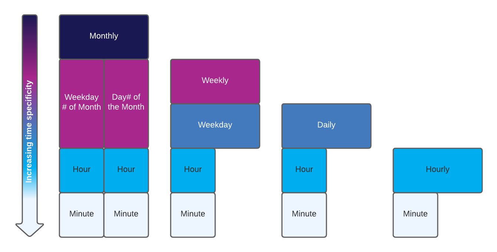

Product requirement can be found [here](prd-recurring-tasks.md).

## Context
This feature will provide the ability to execute an action based on one or more time triggers.  Time triggers will be defined by a user through provided Substrate extrinsics and represent the frequency of which an action should be executed.  Initial implementation will support scheduling actions to be executed for a specified hour.  For example, scheduling an action for the 3rd of March at 1300 GMT means this action will be executed on that day between 1300-1359 GMT.  This feature will build off existing work that allows a task to be scheduled within a single provided time interval.

## Definition
- trigger: conditional logic that has to be true for a task to be executed
- action: the function to execute for a given trigger
- task: a trigger and an action. A user will add a task to execute 10 recurring payments at the 30th of each month.
- transaction: the conventional definition of a transaction in Polkadot (message, payment, anything that is stored in the “ledger”). For example, while the scheduling of a task is a transaction the execution of the action is not.
- timestamp: Unix standard time
- task map: A hashmap that exists in storage. Used to store task information.
- trigger map: A hashmap that exists in storage. Used to store trigger information.
- task queue: A vector that exists in storage. Used to store task_ids that for the tasks that are ready to be executed.
- missed queue: A vector that exists in storage. Used to store task_ids for the tasks that weren’t executed during their scheduled slot.

## Technical Overview
This TRD assumes the ability to schedule an action with a single time trigger exists and is implemented using Option 3: Simple Hour Interval.

## Technical Implementation

### Task Structure
To support scheduling an action to be executed on one or more time triggers the task structure will need to be modified to contain a bounded vector of times as opposed to a single time.  Specifically within the task structure the following will be migrated from `time: u64` to `time: BoundedVec<u64, 24>`.  Initial implementation will be limited to a maximum of 24 timestamps. 

### Scheduling
Scheduling a task will be done through an extrinsic.  The extrinsic will require a user to provide a list of Unix timestamps containing a minimum of 1 timestamp and maximum of 24.

Scheduling of a task will consist of 3 main pieces within the blockchain code:
1. Creating an instance of the task.  More information on task creation can be found here.
2. Adding the hashed task to the Task Map.
3. For each timestamp, inserting the task Id of the task into the Trigger Map.
Additional validation will be needed for the time vector to remove any duplicate timestamps before creating the task structure.

There is always the possibility that one of the provided timestamps within the Trigger Map may be full.  In this case the extrinsic will fail.  To support this scenario, all interactions with RocksDB for task scheduling will be written as a transaction.  Allowing for rolling back any successful insertions into the Trigger Map before the point of failure.

### Running
The process to run a task does not change except for the clean up for a task after it has fully executed.  More on the process of running a task can be found here.  A task is only considered fully executed after every trigger in the time vector has been triggered.  At this time the task can be removed from the Task Map.  To know if a task has been fully executed, each time a task is triggered the current trigger time should be compared with the last time in the sorted time vector.  If the current trigger time is equal to the last time in the vector then the task will not be triggered again and can be removed.

### Cancellation
Canceling a task will be requested through an extrinsic.  The extrinsic will require the Id of the task to be canceled.  To cancel a task will require removing the task Id from all remaining time triggers in the Trigger Map.  This will be done by sorting the task’s `time` vector and traversing in reverse so as to read it in descending order, checking each timestamp in the Trigger Map and removing the task Id. The vector will continue to be traversed until a timestamp less than the time of the requested cancellation is reached.

### Extrinsics
**Schedule**
There are two extrinsics that currently exist for scheduling tasks,  `scheduleNativeTransferTask` and `scheduleNotifyTask`.  These two extrinsics will need to be migrated to take an array of unix timestamps instead of a single unix timestamp. 

**Cancel**
No changes are needed for the inputs of the current cancel extrinsic.
