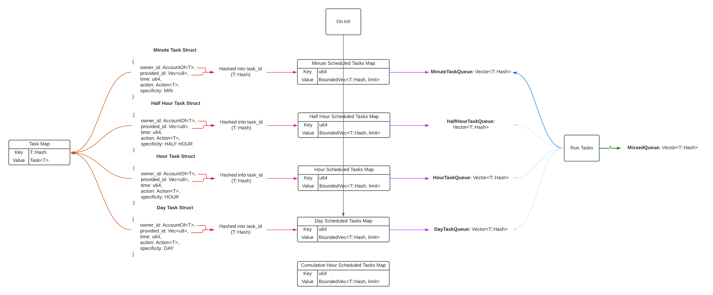
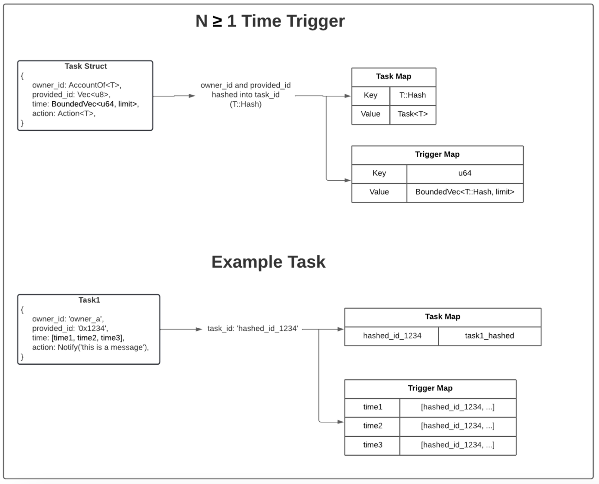

## Context
This is a feature that will allow people to schedule tasks with different time interval tolerances. This will use the existing task infrastructure built in TUR MVP: Native token transfer. The existing work is all based off of a single minute time interval. This comes with some assumptions and implications that will need to be revisited with multiple time intervals. With these different time intervals, we will need to be able to prioritize the different intervals, keep them separate along with their expiration and trigger behavior.

## Implementation Details
### Option 1: Time Slot Buckets
**Task Storage**

This solution is based around the user's need for having different tolerances for how quickly the user wants the task to be executed. This solution offers 4 predefined buckets: minute, 15 minute, hour, day. These buckets mean that a task scheduled will be completed within the bucket that it was scheduled in. For example, if the task is scheduled in the hour bucket, the task will be completed within that hour. If it is not completed within that hour, the task will no longer run. Similarly, if the task is scheduled within a minute bucket, then that means that the task will be completed within that minute. If the task is not completed within the minute, then the task will not run at all.

This implementation tries to address the following problems:
1. Finding a Time Slot
2. All Tasks Handle “being missed” the same

In order to allow for different behaviors from the different time intervals, but still keep the system performant, we will have to duplicate a number of storage items to maintain performance along with the different behaviors.

**Existing Minute Behavior**
1. User inputs task to be run at certain time
2. `schedule_{transfer/notify}_task` function will do validation checks, create task in task map and then schedule task in schedule map
3. Trigger tasks hook will move tasks from scheduled map to task queue
4. Will run tasks
5. Move any remaining tasks that didn’t execute within the minute into missed queue
6. If there is additional space in the block, execute on missed queue and notify

**New Time Interval Behavior**
On insert:
1. User inputs task to be run at certain time
2. `schedule_{transfer/notify}_task` function will do validation checks for that time interval, create task in task map and then schedule task in that interval’s schedule map 

On time interval (for single given time interval):
1. Trigger tasks hook will move tasks in that interval’s task queue into the missed queue. And then it will fill that interval’s task queue with tasks from that interval’s corresponding scheduled tasks map
2. Will run tasks in the task queue
3. Leave any uncompleted tasks in task queue for next block
4. If there is additional space in the block, fire missed event notification for tasks that are on the missed queue

Off time interval:
1. Trigger tasks will run tasks in the task queue
2. Leave any uncompleted tasks in task queue for next block
3. If there is additional space in the block, execute on missed queue and notify

How to tell if on/off interval:
- Have memory of previous valid interval. 
- Also check what is the next valid interval
- Scenarios/logic:
    - If current timestamp is less than next valid interval, then off interval (continue executing tasks)
    - If current timestamp is same as next valid interval, then on interval (and time to adjust previous valid interval, empty and update task queue, etc etc) 
    - If current timestamp is greater than next valid interval, then something is broken (shouldn’t happen)

### Option 2: Sorted Queues
This option triggers tasks on the minute, much like it does in the existing v0 today. We would largely keep today’s data structures, while changing how people interact with the extrinsics. Then, through the use of a sorted queue, we can actually simplify whether something is “missed” or not and execute as needed based on the time window. This change requires us to implement a slightly different extrinsic and reimplement how we currently use the task queue, but otherwise, it should remain completely the same.

This implementation tries to address the following problems:
1. Unreliable block time - in case of outages, this handles the tasks from the outages a lot more smoothly
2. All tasks handle “being missed” the same
3. **Finding a time slot: is handled by providing the user with perfect information and allowing them to make the decision on their own.

#### API/extrinsics Changes
The big change for the API would be to require users/SDK to add an additional parameter into the API, namely an `end_time`. This would basically show their bound for tolerance, which is to say, what is the latest time they would expect this task to have run? As for when the task will be scheduled to run, each task will still have a timeslot (per minute) when it will be triggered, much like the current iteration. If it is past this time, the task will no longer be run and will instead be moved into the missed queue.

The user would also have to go look up our current state of scheduled tasks, which shows when there are free slots and when tasks are cheaper. This can be through looking at the chain state, through an oracle/third party service or some other means, where the user can simply determine the best slot to schedule their task. This does put a lot of manual work onto the user and assumes that the user doesn’t really care about the exact timing of the execution of the task.

#### Recurring Tasks
This just means that Recurring Tasks will have to be input using an array of tuples rather than an array of strings.

### Option 3: Simple Hour Interval, Allow for user feedback
Given the lack of data that we have, we have decided to gather data from real world use cases by allowing for a more "lenient" time interval.

This implementation tries to address the following problems:
1. Finding a time slot: by assuming a generic 1 hour time slot as (we hypothesize) the most generically useful to users.

As this is the case, we simply just have to transition our current time intervals from 1 minute to 1 hour and incrementally solve for the following set of problems:
1. Scheduling a task to run more than once. See [this TRD](recurring-tasks.md)
2. Unreliable block time. This has a Parity dependency.
3. All tasks handle “being missed” the same. This needs user feedback.
4. Finding a time slot (down to the minute). While we can handle hourly, the more granular the time slot the higher the complexity of handling missed tasks and slippage.

## Technical Implementation
We have decided to go with **Option 3** in the 3 options above, due to the relative complexity of the other options and how opinionated the implementation would be. The pain in reversing such a decision would be fairly great and would incur a large amount of development time. Therefore, we are better suited to just building out something simple that will allow us the flexibility to iterate and change our design down the road as we get more user feedback.

Code changes: Adjust timestamps to use hours rather than minutes.

